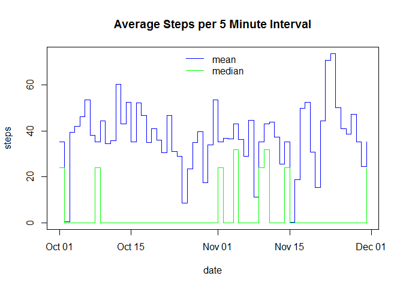

# Reproducible Research: Peer Assessment 1

## Loading and preprocessing the data

```r
##setwd("GitHub/RepData_PeerAssessment1")
activityData <- read.csv("activity.csv", na.strings="NA")
activityData$date <- as.Date(activityData$date)
activityData$hour <- as.double(as.integer(activityData$interval / 100 )) + (activityData$interval %% 100) / 60
```

## What is mean total number of steps taken per day?
1. Make a histogram of the total number of steps taken each day.

```r
totalPerDay <- aggregate(activityData$steps, by=list(activityData$date), FUN=sum)
hist(totalPerDay$x, main = paste("Histogram of Number of Steps per Day"), xlab = "Number of Steps per Day")
```

 

2. Calculate and report the mean and median total number of steps taken per day.

```r
meanPerDay <- aggregate(activityData$steps, by=list(activityData$date), FUN=mean)
colnames(meanPerDay) = c("date", "mean")
medianPerDay <- aggregate(activityData$steps, by=list(activityData$date), FUN=median)
colnames(medianPerDay) = c("date", "median")

# report the mean and median totla number of stesp taken per day
stepsPerDay <- meanPerDay
stepsPerDay$median <- medianPerDay$median
stepsPerDay
```

```
##          date       mean median
## 1  2012-10-01         NA     NA
## 2  2012-10-02  0.4375000      0
## 3  2012-10-03 39.4166667      0
## 4  2012-10-04 42.0694444      0
## 5  2012-10-05 46.1597222      0
## 6  2012-10-06 53.5416667      0
## 7  2012-10-07 38.2465278      0
## 8  2012-10-08         NA     NA
## 9  2012-10-09 44.4826389      0
## 10 2012-10-10 34.3750000      0
## 11 2012-10-11 35.7777778      0
## 12 2012-10-12 60.3541667      0
## 13 2012-10-13 43.1458333      0
## 14 2012-10-14 52.4236111      0
## 15 2012-10-15 35.2048611      0
## 16 2012-10-16 52.3750000      0
## 17 2012-10-17 46.7083333      0
## 18 2012-10-18 34.9166667      0
## 19 2012-10-19 41.0729167      0
## 20 2012-10-20 36.0937500      0
## 21 2012-10-21 30.6284722      0
## 22 2012-10-22 46.7361111      0
## 23 2012-10-23 30.9652778      0
## 24 2012-10-24 29.0104167      0
## 25 2012-10-25  8.6527778      0
## 26 2012-10-26 23.5347222      0
## 27 2012-10-27 35.1354167      0
## 28 2012-10-28 39.7847222      0
## 29 2012-10-29 17.4236111      0
## 30 2012-10-30 34.0937500      0
## 31 2012-10-31 53.5208333      0
## 32 2012-11-01         NA     NA
## 33 2012-11-02 36.8055556      0
## 34 2012-11-03 36.7048611      0
## 35 2012-11-04         NA     NA
## 36 2012-11-05 36.2465278      0
## 37 2012-11-06 28.9375000      0
## 38 2012-11-07 44.7326389      0
## 39 2012-11-08 11.1770833      0
## 40 2012-11-09         NA     NA
## 41 2012-11-10         NA     NA
## 42 2012-11-11 43.7777778      0
## 43 2012-11-12 37.3784722      0
## 44 2012-11-13 25.4722222      0
## 45 2012-11-14         NA     NA
## 46 2012-11-15  0.1423611      0
## 47 2012-11-16 18.8923611      0
## 48 2012-11-17 49.7881944      0
## 49 2012-11-18 52.4652778      0
## 50 2012-11-19 30.6979167      0
## 51 2012-11-20 15.5277778      0
## 52 2012-11-21 44.3993056      0
## 53 2012-11-22 70.9270833      0
## 54 2012-11-23 73.5902778      0
## 55 2012-11-24 50.2708333      0
## 56 2012-11-25 41.0902778      0
## 57 2012-11-26 38.7569444      0
## 58 2012-11-27 47.3819444      0
## 59 2012-11-28 35.3576389      0
## 60 2012-11-29 24.4687500      0
## 61 2012-11-30         NA     NA
```

```r
plot(meanPerDay$date, meanPerDay$mean, type = "s",
     main = "Steps per 5 Minute Interval", xlab = "date", ylab = "steps", col='blue')
lines(medianPerDay$date, medianPerDay$median, type = "s", col = "green")
legend("top", legend = c("mean", "median"), bty = "n", lty = 1, col = c("blue", "green"))
```

 

## What is the average daily activity pattern?
1. Make a time series plot (i.e. type = "s") of the 5-minute interval (x-axis) and the average number of steps taken, averaged across all days (y-axis)

```r
activity <- activityData[! is.na(activityData$steps),]
meanPerInterval <- aggregate(activity$steps, by=list(activity$hour), FUN = mean)
colnames(meanPerInterval) = c("hour", "steps")
plot(meanPerInterval$hour, meanPerInterval$steps, type = "s",
     main = "Average Steps per 5 Minute Interval", xlab = "hour", ylab = "steps per 5 minute interval")
```

 

2. Which 5-minute interval, on average across all the days in the dataset, contains the maximum number of steps?

```r
maxSteps <- meanPerInterval[meanPerInterval$steps == max(meanPerInterval$steps), c("steps", "hour")]
maxStepsTime <- sprintf("%02d:%02d", as.integer(maxSteps$hour), as.integer((maxSteps$hour %% 1) * 60))
```

The max number of steps per 5 minute interval, averaged across all of the days in the dataset,
is 206.17 steps at 08:35.

## Imputing missing values
1. Calculate and report the total number of missing values in the dataset (i.e. the total number of rows with NAs)

```r
missingValues <- sum(is.na(activityData$steps))
```

There are 2304 missing values in the dataset.

2. Devise a strategy for filling in all of the missing values in the dataset. The strategy does not need to be sophisticated. For example, you could use the mean/median for that day, or the mean for that 5-minute interval, etc.

Missing values will be filled in with the mean steps for the 5-minute interval and type of day of the week\, i.e. weekday\, weekend.

* First a new factor variable will be created in the dataset with two levels - "weekday" and "weekend".
* Then the mean steps for the interval and day type will be calculated.
* These values will be used to replace the NA values in the new dataset.

3. Create a new dataset that is equal to the original dataset but with the missing data filled in.

```r
dayType <- function(date) {
    weekday <- weekdays(date)
    if (weekday == "Saturday" || weekday == "Sunday") {
        return("weekend")
    }
    return("weekday")
}

# add column daytype
activity$daytype <- factor(sapply(as.Date(activity$date), dayType))

# create dataset to fill NA values
meanSteps <- aggregate(activity$steps, by=list(activity$interval, activity$daytype), FUN = mean)
colnames(meanSteps) <- c("interval", "daytype", "steps")

# copy original dataset
newActivity <- activityData

# fill in NA values
newActivity$daytype <- factor(sapply(as.Date(newActivity$date), dayType))
rowCnt <- nrow(newActivity)
for(row in 1:rowCnt) {
    if(is.na(newActivity$steps[row])) {
        interval <- newActivity$interval[row]
        type <- as.character(newActivity$daytype[row])
        newActivity$steps[row] <- as.integer(meanSteps[meanSteps$interval == interval & meanSteps$daytype == type, "steps"] + 0.5)
    }
}
```

4. Make a histogram of the total number of steps taken each day and Calculate and report the mean and median total number of steps taken per day. Do these values differ from the estimates from the first part of the assignment? What is the impact of imputing missing data on the estimates of the total daily number of steps?


```r
newTotalPerDay <- aggregate(newActivity$steps, by=list(newActivity$date), FUN=sum)
hist(newTotalPerDay$x, main = paste("Histogram of Number of Steps per Day"), xlab = "Number of Steps per Day")
```

 

```r
newMeanPerDay <- aggregate(newActivity$steps, by=list(newActivity$date), FUN=mean)
colnames(newMeanPerDay) = c("date", "mean")
newMedianPerDay <- aggregate(newActivity$steps, by=list(newActivity$date), FUN=median)
colnames(newMedianPerDay) = c("date", "median")

# report the mean and median totla number of stesp taken per day
stepsPerDay <- meanPerDay
stepsPerDay$median <- medianPerDay$median
stepsPerDay
```

```
##          date       mean median
## 1  2012-10-01         NA     NA
## 2  2012-10-02  0.4375000      0
## 3  2012-10-03 39.4166667      0
## 4  2012-10-04 42.0694444      0
## 5  2012-10-05 46.1597222      0
## 6  2012-10-06 53.5416667      0
## 7  2012-10-07 38.2465278      0
## 8  2012-10-08         NA     NA
## 9  2012-10-09 44.4826389      0
## 10 2012-10-10 34.3750000      0
## 11 2012-10-11 35.7777778      0
## 12 2012-10-12 60.3541667      0
## 13 2012-10-13 43.1458333      0
## 14 2012-10-14 52.4236111      0
## 15 2012-10-15 35.2048611      0
## 16 2012-10-16 52.3750000      0
## 17 2012-10-17 46.7083333      0
## 18 2012-10-18 34.9166667      0
## 19 2012-10-19 41.0729167      0
## 20 2012-10-20 36.0937500      0
## 21 2012-10-21 30.6284722      0
## 22 2012-10-22 46.7361111      0
## 23 2012-10-23 30.9652778      0
## 24 2012-10-24 29.0104167      0
## 25 2012-10-25  8.6527778      0
## 26 2012-10-26 23.5347222      0
## 27 2012-10-27 35.1354167      0
## 28 2012-10-28 39.7847222      0
## 29 2012-10-29 17.4236111      0
## 30 2012-10-30 34.0937500      0
## 31 2012-10-31 53.5208333      0
## 32 2012-11-01         NA     NA
## 33 2012-11-02 36.8055556      0
## 34 2012-11-03 36.7048611      0
## 35 2012-11-04         NA     NA
## 36 2012-11-05 36.2465278      0
## 37 2012-11-06 28.9375000      0
## 38 2012-11-07 44.7326389      0
## 39 2012-11-08 11.1770833      0
## 40 2012-11-09         NA     NA
## 41 2012-11-10         NA     NA
## 42 2012-11-11 43.7777778      0
## 43 2012-11-12 37.3784722      0
## 44 2012-11-13 25.4722222      0
## 45 2012-11-14         NA     NA
## 46 2012-11-15  0.1423611      0
## 47 2012-11-16 18.8923611      0
## 48 2012-11-17 49.7881944      0
## 49 2012-11-18 52.4652778      0
## 50 2012-11-19 30.6979167      0
## 51 2012-11-20 15.5277778      0
## 52 2012-11-21 44.3993056      0
## 53 2012-11-22 70.9270833      0
## 54 2012-11-23 73.5902778      0
## 55 2012-11-24 50.2708333      0
## 56 2012-11-25 41.0902778      0
## 57 2012-11-26 38.7569444      0
## 58 2012-11-27 47.3819444      0
## 59 2012-11-28 35.3576389      0
## 60 2012-11-29 24.4687500      0
## 61 2012-11-30         NA     NA
```

```r
plot(newMeanPerDay$date, newMeanPerDay$mean, type = "s",
     main = "Average Steps per 5 Minute Interval", xlab = "date", ylab = "steps", col="blue")
lines(newMedianPerDay$date, newMedianPerDay$median, type = "s", col = "green")
legend("top", legend = c("mean", "median"), bty = "n", lty = 1, col = c("blue", "green"))
```

 

The shape of the histagram has not changed.  The only difference is more data points.

The average number of steps per day has not changed, other then missing values are now filled in.

The median number of steps is now much larger for days that were missing steps.  This is because the average values used are genearlly greater than the median.  A better way to impute the missing values would have been to take a random sample of the non-na values for the same interval and day type.

## Are there differences in activity patterns between weekdays and weekends?

```r
weekdayActivity <- newActivity[newActivity$daytype == "weekday",]
weekdayMeanPerInterval <- aggregate(weekdayActivity$steps, by=list(weekdayActivity$hour), FUN = mean)
colnames(weekdayMeanPerInterval) = c("hour", "steps")
weekendActivity <- newActivity[newActivity$daytype == "weekend",]
weekendMeanPerInterval <- aggregate(weekendActivity$steps, by=list(weekendActivity$hour), FUN = mean)
colnames(weekendMeanPerInterval) = c("hour", "steps")
```

```r
plot(weekdayMeanPerInterval$hour, weekdayMeanPerInterval$steps, type="s",
     main = "Average Steps per 5 Minute Interval", xlab = "hour", ylab = "steps per 5 minute interval", col="blue")
lines(weekendMeanPerInterval$hour, weekendMeanPerInterval$steps, type="s", col="green")
legend("topright", legend = c("weekday", "weekend"), bty = "n", lty = 1, col = c("blue", "green"))
```

 

```r
library(ggplot2)
weekdayMeanPerInterval$daytype = "weekday"
weekendMeanPerInterval$daytype = "weekend"
meanPerInterval <- rbind(weekdayMeanPerInterval, weekendMeanPerInterval)
str(meanPerInterval)
```

```
## 'data.frame':	576 obs. of  3 variables:
##  $ hour   : num  0 0.0833 0.1667 0.25 0.3333 ...
##  $ steps  : num  2.2889 0.4 0.1556 0.1778 0.0889 ...
##  $ daytype: chr  "weekday" "weekday" "weekday" "weekday" ...
```

```r
qplot(hour, steps, data = meanPerInterval, geom = "line",
      main = "Average Steps per 5 Minute Interval", facets = daytype ~ .)
```

 

The activity patterns between weekdays and weekends are different.
